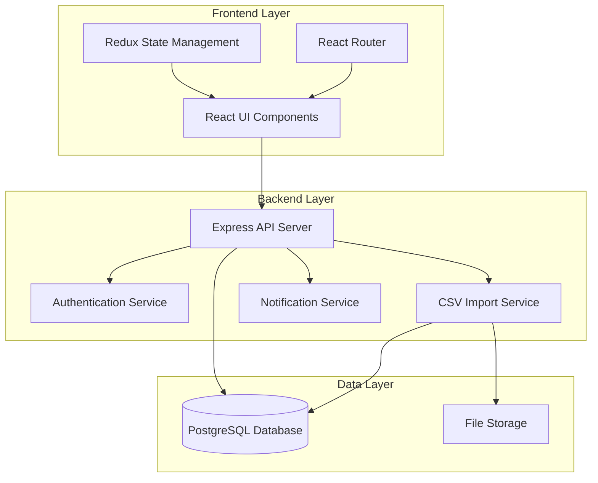

# Design Document: Grip Customer Management System

## Overview

Grip is a hybrid customer management and ticket system designed for rapid deployment and immediate productivity. The system combines simple customer relationship management with task-based ticket handling, enabling small teams to manage customer interactions and tasks without complex configuration.

The architecture follows a modern web application pattern with a React frontend, Node.js/Express backend, and PostgreSQL database. The system emphasizes simplicity, speed, and zero-configuration setup while maintaining the flexibility to handle both customer data and task management workflows.

## Architecture

### System Architecture



### Component Architecture

The system is organized into distinct modules:

- **Customer Management**: Handles customer data, import/export, and customer profiles
- **Ticket Management**: Manages ticket lifecycle, assignments, and status tracking
- **Pipeline Management**: Provides workflow stages and transitions
- **User Management**: Authentication, authorization, and user profiles
- **Command Center**: Unified interface for managing all customer interactions and tickets

## Components and Interfaces

### Frontend Components

#### Dashboard Component
- **Purpose**: Main landing page showing overview of tickets and customers
- **Props**: `user`, `tickets`, `customers`, `metrics`
- **State**: `selectedFilters`, `viewMode`
- **Key Methods**: `refreshData()`, `applyFilters()`, `switchView()`

#### Command Center Component
- **Purpose**: Unified view for managing all tickets and customer interactions
- **Props**: `tickets`, `customers`, `filters`
- **State**: `selectedTicket`, `sortOrder`, `activeFilters`
- **Key Methods**: `updateTicketStatus()`, `assignTicket()`, `addNote()`

#### Customer Import Component
- **Purpose**: Handles CSV file upload and automatic field mapping
- **Props**: `onImportComplete`, `existingCustomers`
- **State**: `uploadedFile`, `mappingPreview`, `importProgress`
- **Key Methods**: `processFile()`, `autoMapFields()`, `executeImport()`

#### Ticket Pipeline Component
- **Purpose**: Visual representation of tickets in different stages
- **Props**: `tickets`, `stages`, `onTicketMove`
- **State**: `draggedTicket`, `stageFilters`
- **Key Methods**: `moveTicket()`, `updateStage()`, `filterByStage()`

### Backend Services

#### Customer Service
```typescript
interface CustomerService {
  createCustomer(data: CustomerData): Promise<Customer>
  updateCustomer(id: string, data: Partial<CustomerData>): Promise<Customer>
  getCustomer(id: string): Promise<Customer>
  listCustomers(filters?: CustomerFilters): Promise<Customer[]>
  deleteCustomer(id: string): Promise<void>
  importCustomers(csvData: string): Promise<ImportResult>
}
```

#### Ticket Service
```typescript
interface TicketService {
  createTicket(data: TicketData): Promise<Ticket>
  updateTicket(id: string, data: Partial<TicketData>): Promise<Ticket>
  getTicket(id: string): Promise<Ticket>
  listTickets(filters?: TicketFilters): Promise<Ticket[]>
  assignTicket(ticketId: string, userId: string): Promise<Ticket>
  moveTicketStage(ticketId: string, stage: Stage): Promise<Ticket>
  addTicketNote(ticketId: string, note: string): Promise<Note>
}
```

#### Import Service
```typescript
interface ImportService {
  parseCSV(file: Buffer): Promise<ParsedData>
  autoMapFields(headers: string[]): Promise<FieldMapping>
  validateData(data: any[], mapping: FieldMapping): Promise<ValidationResult>
  importCustomers(data: any[], mapping: FieldMapping): Promise<ImportResult>
}
```

## Data Models

### Customer Model
```typescript
interface Customer {
  id: string
  name: string
  email: string
  phone?: string
  company?: string
  notes?: string
  createdAt: Date
  updatedAt: Date
  tickets: Ticket[]
}
```

### Ticket Model
```typescript
interface Ticket {
  id: string
  title: string
  description: string
  customerId: string
  assignedUserId?: string
  stage: Stage
  priority: Priority
  createdAt: Date
  updatedAt: Date
  completedAt?: Date
  notes: Note[]
  customer: Customer
}

enum Stage {
  NEW = 'new',
  IN_PROGRESS = 'in_progress',
  WAITING = 'waiting',
  COMPLETED = 'completed'
}

enum Priority {
  LOW = 'low',
  MEDIUM = 'medium',
  HIGH = 'high',
  URGENT = 'urgent'
}
```

### Note Model
```typescript
interface Note {
  id: string
  content: string
  ticketId?: string
  customerId?: string
  userId: string
  createdAt: Date
  user: User
}
```

### User Model
```typescript
interface User {
  id: string
  email: string
  name: string
  passwordHash: string
  isVerified: boolean
  createdAt: Date
  updatedAt: Date
}
```

## Correctness Properties

*A property is a characteristic or behavior that should hold true across all valid executions of a system-essentially, a formal statement about what the system should do. Properties serve as the bridge between human-readable specifications and machine-verifiable correctness guarantees.*

Based on the prework analysis, here are the key correctness properties for the Grip system:

### Property 1: CSV Field Auto-Mapping
*For any* CSV file with standard business headers, the Contact_Processor should correctly identify and map common fields (name, email, phone, company) without user intervention
**Validates: Requirements 1.1**

### Property 2: Default Stage Assignment
*For any* newly created ticket, the system should automatically assign it to the "New" stage
**Validates: Requirements 2.2**

### Property 3: Stage Transition Audit Trail
*For any* ticket stage transition, the system should record the transition timestamp and the user who made the change
**Validates: Requirements 2.3**

### Property 4: Completion Timestamp Recording
*For any* ticket moved to "Completed" stage, the system should automatically record the completion date and time
**Validates: Requirements 2.5**

### Property 5: Command Center Unified Display
*For any* set of tickets in the system, the Command Center should display all tickets with their associated customer information and current status
**Validates: Requirements 3.1**

### Property 6: Real-time Command Center Updates
*For any* newly created ticket, it should appear in the Command Center immediately without requiring a page refresh
**Validates: Requirements 3.4**

### Property 7: Customer-Ticket Association Requirement
*For any* ticket creation attempt, the system should require association with an existing customer or creation of a new customer record
**Validates: Requirements 4.1**

### Property 8: Customer-Ticket Referential Integrity
*For any* customer with associated tickets, the system should prevent deletion of that customer
**Validates: Requirements 4.5**

### Property 9: Ticket Assignment Notification
*For any* ticket assignment to a user, the system should generate a notification to the assigned user
**Validates: Requirements 5.3**

### Property 10: Required Field Validation
*For any* ticket creation attempt, the system should require minimum information (customer, title, description) and reject incomplete submissions
**Validates: Requirements 5.1**

### Property 11: Authentication Validation
*For any* login attempt, the system should allow access only with valid credentials and reject invalid ones
**Validates: Requirements 6.1**

### Property 12: Data Export Completeness
*For any* data export request, the generated CSV should include all customer and ticket data with complete field information
**Validates: Requirements 7.1, 7.3**

### Property 13: Auto-save Functionality
*For any* user input session, the system should automatically save changes every 30 seconds to prevent data loss
**Validates: Requirements 8.5**

## Error Handling

### Client-Side Error Handling

The frontend implements comprehensive error boundaries and user-friendly error messages:

- **Network Errors**: Display retry options and offline indicators
- **Validation Errors**: Show inline field-level validation with clear guidance
- **Import Errors**: Provide detailed feedback on CSV parsing issues with line-by-line error reporting
- **Authentication Errors**: Clear messaging for login failures, expired sessions, and permission issues

### Server-Side Error Handling

The backend provides structured error responses with appropriate HTTP status codes:

- **400 Bad Request**: Validation errors with detailed field-level messages
- **401 Unauthorized**: Authentication failures with clear next steps
- **403 Forbidden**: Permission errors with explanation of required access
- **404 Not Found**: Resource not found with suggestions for valid alternatives
- **500 Internal Server Error**: Generic server errors with tracking IDs for support

### Data Integrity Protection

- **Transaction Management**: All multi-step operations use database transactions
- **Referential Integrity**: Foreign key constraints prevent orphaned records
- **Input Validation**: Server-side validation for all user inputs
- **SQL Injection Prevention**: Parameterized queries and ORM protection
- **XSS Prevention**: Input sanitization and output encoding

## Testing Strategy

### Dual Testing Approach

The system uses both unit testing and property-based testing for comprehensive coverage:

**Unit Tests**: Verify specific examples, edge cases, and error conditions
- Test specific CSV import scenarios with known data
- Test authentication flows with valid/invalid credentials
- Test UI component rendering with specific props
- Test API endpoints with known request/response pairs

**Property Tests**: Verify universal properties across all inputs
- Test CSV import with randomly generated files and headers
- Test ticket creation with random valid/invalid data combinations
- Test stage transitions with random ticket states
- Test filtering and sorting with random data sets

### Property-Based Testing Configuration

- **Testing Framework**: Jest with fast-check for property-based testing
- **Minimum Iterations**: 100 iterations per property test
- **Test Tagging**: Each property test references its design document property
- **Tag Format**: `Feature: grip-crm, Property {number}: {property_text}`

### Testing Coverage Areas

**Frontend Testing**:
- Component unit tests for UI behavior
- Integration tests for user workflows
- Property tests for data transformation and validation
- End-to-end tests for critical user journeys

**Backend Testing**:
- Unit tests for service layer methods
- Property tests for data processing and validation
- Integration tests for database operations
- API contract tests for endpoint behavior

**Database Testing**:
- Migration tests for schema changes
- Constraint tests for referential integrity
- Performance tests for query optimization
- Backup and recovery tests for data protection

### Continuous Integration

- All tests run on every pull request
- Property tests run with extended iterations in nightly builds
- Performance benchmarks track system responsiveness
- Security scans validate data protection measures